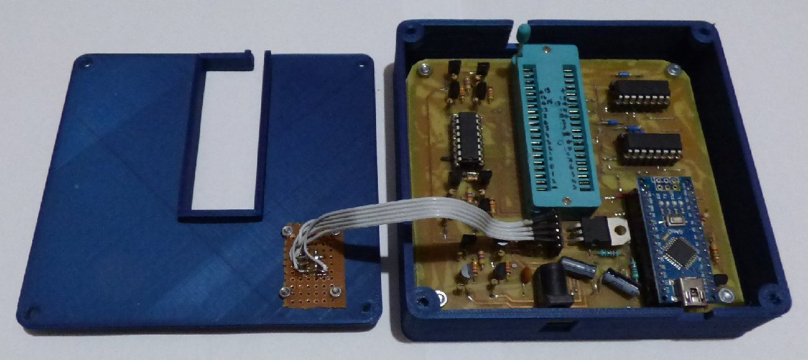
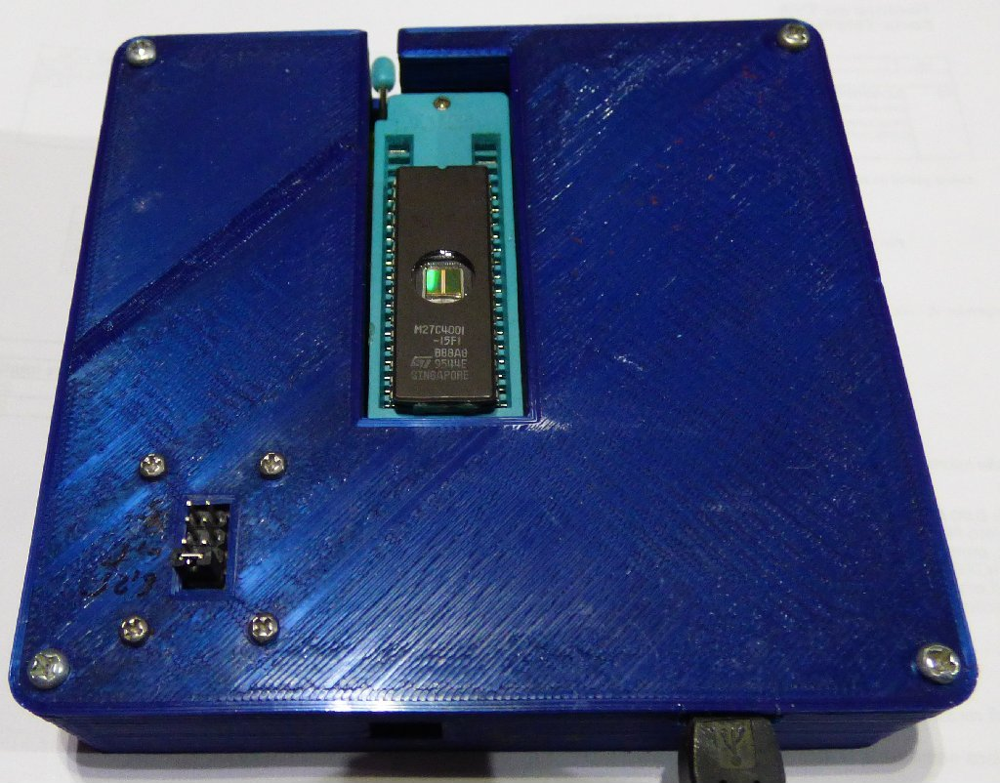
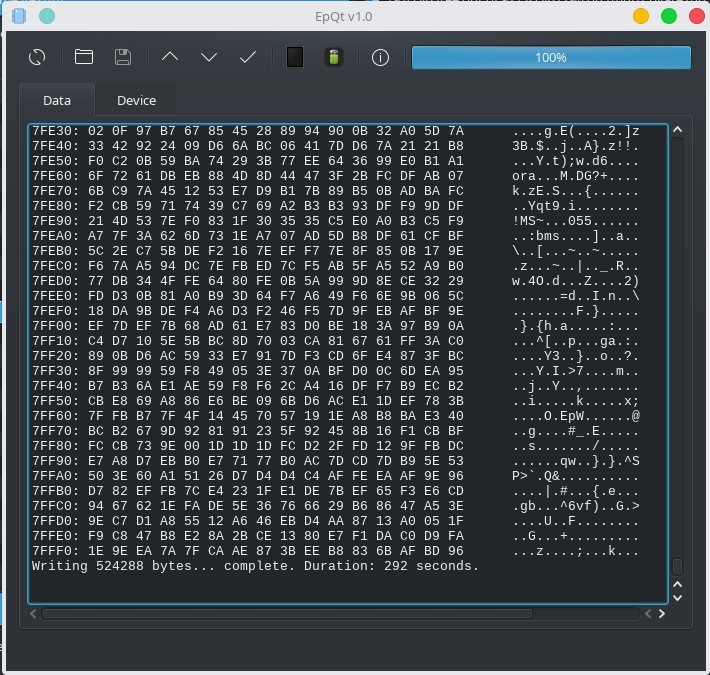
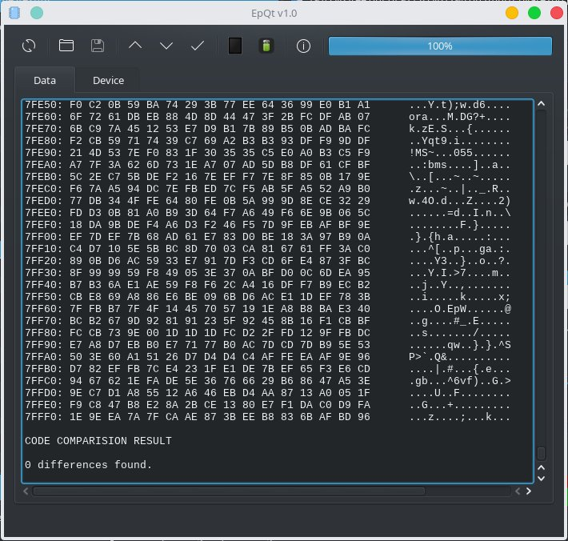
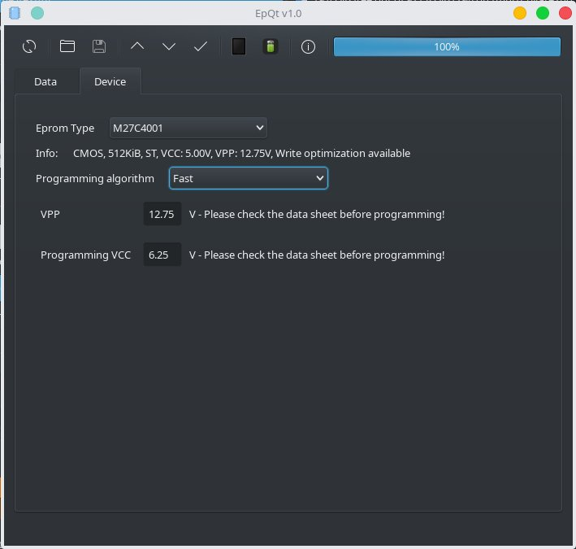

# EpromProgrammer
2716 through 27080 Eprom Programmer

A programmer for EPROMs with capacities between 2KiB (2716 series) and 1MiB (27C080 series).  
It uses an Arduino NANO and few other components.  
As a starting point I used the excelent [arduino_eprom27_programmer](https://github.com/walhi/arduino_eprom27_programmer) project

## Main features
* It supports a large number of EPROMs with different capacities
* 2 programming speeds (normal & fast). Fast programming speed is available if you configure the VCC correctly
* On fast programming alghoritm, writing a 27C040 EPROM takes around 290 seconds
* Error detection on writing
* Additional verify option

## Hardware
All the files which you need in order to create the PCBs are in the [hardware](hardware) folder.

## Case
The files for 3D printing a case are available in [FreeCAD](FreeCAD) folder

## Limitations in current implementation
* No Windows support, but it should be easy to implement

## Supported EPROMs
```
//------------- 2716 -------------
2716 - Generic, 2716 - AMD, ET2716, HN462716, 2716 - Intel, M2716, M5L2716K, MBM2716, MCM2716, uPD2716
//------------- 27C16 -------------
27C16 - Generic, 27C16 - National, AM2716B, NMC27C16B
//------------- 2732 -------------
2732 - Generic, AM2732, AM9732, F2732, HN462732, 2732A, M2732A, MBM2732, NTE2732A, TMM2732D, uPD2732A
//------------- 27C32 -------------
27C32 - Generic, AM2732B, NMC27C32B, WS57C43C
//------------- 2764 -------------
2764 - Generic, 2764A - Intel, M2764A, M5L2764K, NTE2764, TMM2764AD
//------------- 27C64 -------------
27C64 - Generic, 27C64 - Microchip, Cy7C266, MBM27C64, NMC27C64, TMS27C64
//------------- 27128 -------------
27128 - Generic, HN4827128G, HN27128, M27128A - Intel, M27128A - ST, M5L27128K, M5M27C128K, MBM27128, NTE21128, TMM27128AD, TMS27128, uPD27128
//------------- 27C128 -------------
27C128 - Generic, 27C128 - Microchip, AM27C128, AT27C128, CY27C128, LH57126, M27C128, MSM27C128, NM27C128 - Fairchild, NM27C128 - National, QP27C128, SMJ27C128, TMS27C128
//------------- 27256 -------------
27256 - Generic, A68C256, AT27256, 27256 - Intel, M5L27256K, MBM27256, MSM27256, TMM27256, uPD27256
//------------- 27C256 -------------
27C256 - Generic, 27C256 - Microchip, AM27C256, AM27H256, CXK27C256DQ, CY27C256, CY27H256, CY7C274, EM27C256, FM27C256, HN27C256A, HN27C256AG, IS27C256, M27C256B, M5M27C256K, MBM27C256, 27HC256, MSM27C256H, NM27C256 - Fairchild, NM27C256 - National, NM27LC256, NMC27C256, NMC87C257, NPX27C256, QP27C256, 27C256 - SEEQ, M27C256 - SEEQ, SMJ27C256 - ASI, SMJ27C256 - TI, SPM27C256, TC57256, TMS27C256, TMS87C257, uPD27C256
//------------- 27512 -------------
27512 - Generic, 27512 - Intel, AM27512, HN27512, M27512, M5L27512K, MSM27512, TMM27512AD
//------------- 27C512 -------------
27C512 - Generic, 27C512 - Microchip, 27C512 - Intel, 27C512 - Philips, AM27C512, CXK27C512DQ, CY27C512, CY27H512, EM27C512, FM27C512, HN27C512, IS27HC512, MBM27C512, MX27C512, NM27C512, NM27P512, SMJ27C512 - ASI, SMJ27C512 - TI, TC57512AD, TMS27C512, uPD27C512
//------------- 27C010 -------------
27C010 - Generic, AM27C010, AM27H010, AM27HB010, CY27C010, CY27H010, 27C010 - Intel, EM27C010, FM27C010, HN27C101, IS27C010, M5M27C101K, NM27C010 - Fairchild, NM27C010 - National, NMC27C010, SMJ27C010 - ASI, SMJ27C010 - TI, TMS27C010
//------------- 27C1001 -------------
27C1001 - Generic, CXK27C1001DQ, M27C1001, MBM27C1001, MSM27C1000, MX27C1000, TC57C1001, TC57H1001
//------------- 27C020 -------------
27C020 - Generic, AM27C020, CY27C020, 27C020 - Intel, EM27C020, IS27C020, NM27C020, TMS27C020
//------------- 27C2001 -------------
27C2001 - Generic, M27C2001, MSM27C2000, uPD27C2001
//------------- 27C040 -------------
27C040 - Generic, AM27C040, CY27C040, EM27C040, FM27C040, 27C040 - Intel, NM27C040, NXP27C040, SMJ27C040 - ASI, SMJ27C040 - Micross, SMJ27C040 - TI, TMS27C040
//------------- 27C4001 -------------
27C4001 - Generic, HN27C4001, M27C4001, MBM27C4001, MSM27C401, MX27C4000, TC57C4000, uPD27C4001
//------------- 27C080 -------------
27C080 - Generic, AM27C080, AT27LV080, M27C801, MX27C8000
```

## Programmer images
 

## GUI images
  
